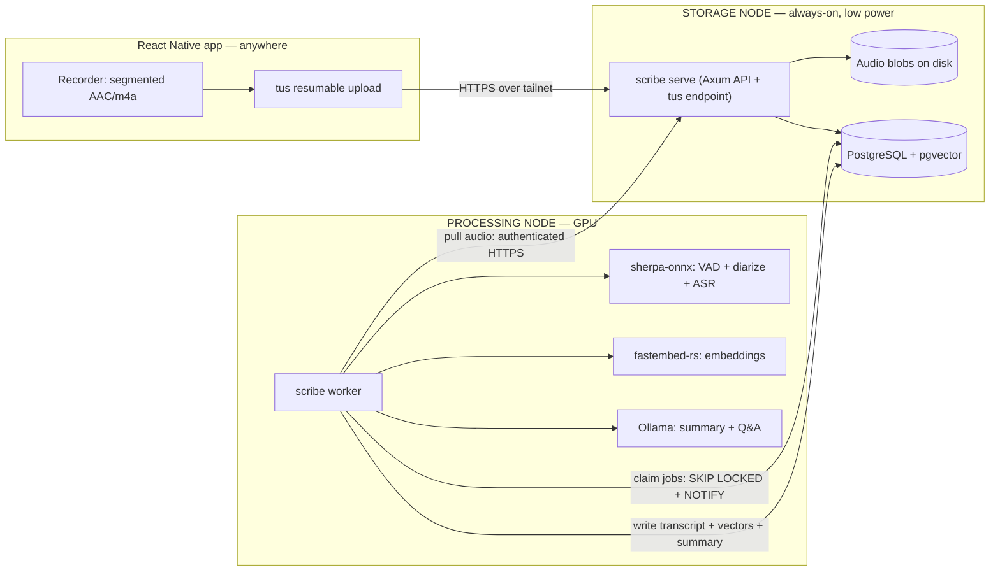
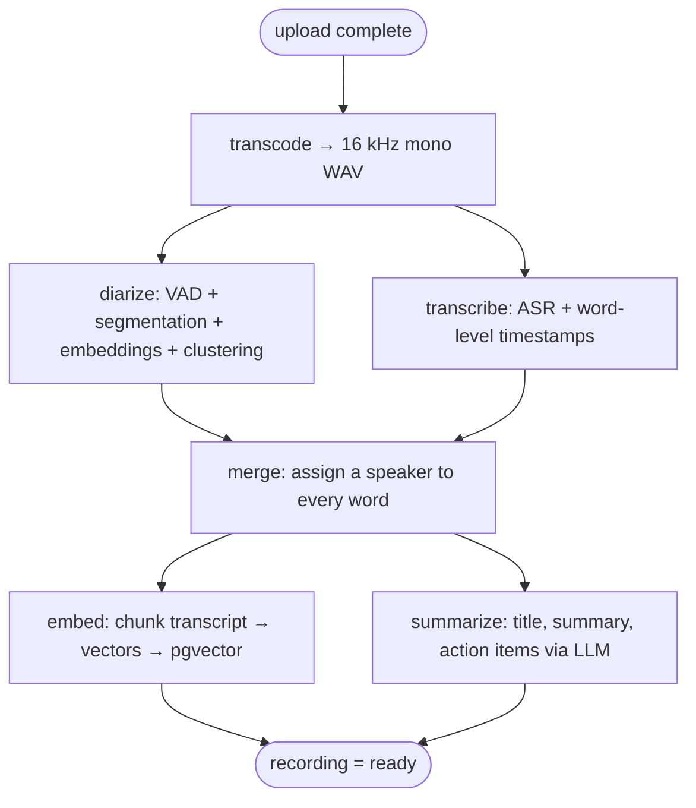

# Architecture

A concise tour of the Scribe system: two nodes, one binary, a six-stage
pipeline, and one stateful service (Postgres + pgvector).

---

## System overview

Two physical machines, three logical roles. All on one Tailscale tailnet.



**Key design properties:**

- Postgres is the single rendezvous point. The processing node holds no durable
  state — it claims a job, pulls audio over HTTPS, runs models, writes results
  back, and forgets. Swap or reboot the GPU box at will; nothing is lost.
- Zero or many workers: they all pull from the same queue. Scale horizontally
  by adding workers or splitting stages across machines.
- One binary (`scribe`), many roles. `serve` and `worker` are subcommands of
  the same Rust binary.

---

## Crate layout

```
scribe/
├── Cargo.toml                  # workspace (resolver = 2)
├── crates/
│   ├── scribe-core/            # Config, domain types, errors — shared by all
│   ├── scribe-db/              # sqlx queries, migrations, SKIP LOCKED queue
│   ├── scribe-asr/             # sherpa-onnx wrappers: VAD + diarization + ASR
│   │                           # feature "onnx" (default) = real; stub otherwise
│   ├── scribe-llm/             # Ollama HTTP client + fastembed-rs embeddings
│   │                           # feature "local-embed" (default) = real; stub otherwise
│   ├── scribe-pipeline/        # Stage implementations + worker loop
│   ├── scribe-api/             # Axum routers, handlers, auth, blob serving
│   └── scribe-cli/             # clap subcommands → wires everything (builds `scribe`)
├── migrations/                 # SQL files applied by `scribe migrate`
└── mobile/                     # React Native / Expo app (separate agent)
```

### Feature flags

| Flag | Crate | Effect |
|---|---|---|
| `onnx` (default) | `scribe-asr`, `scribe-cli` | Real sherpa-onnx speech stack (VAD, diarization, ASR) |
| `local-embed` (default) | `scribe-llm`, `scribe-api`, `scribe-cli` | Real fastembed-rs in-process embeddings |
| `--no-default-features` on `scribe-cli` | all | Disables both; stub engines replace real ones |

---

## The job DAG (pipeline)

Each recording flows through six stages. Each stage is a separate job row in
Postgres, enabling per-stage retry granularity and parallelism.



Stage details:

| Stage | What it does | Engine |
|---|---|---|
| `transcode` | Concatenate uploaded AAC segments → 16 kHz mono WAV via ffmpeg | ffmpeg on PATH |
| `diarize` | Silero VAD strips silence; pyannote-seg finds speaker boundaries; speaker-embedding extractor + FastClustering groups them | sherpa-onnx |
| `transcribe` | ASR over the whole WAV with word-level timestamps (Parakeet TDT or Whisper) | sherpa-onnx |
| `merge` | Assign each word the speaker whose diarized turn maximally overlaps; WhisperX pattern | Pure Rust |
| `embed` | Chunk transcript by speaker-turn/time window; embed each chunk; write to `chunks.embedding` (pgvector halfvec) | fastembed-rs |
| `summarize` | POST transcript to Ollama; parse title / summary / action items / topics / decisions | Ollama |

`transcode` always runs first. `diarize` and `transcribe` run concurrently
after it. `merge` gates on both. `embed` and `summarize` run concurrently after
`merge`. When both `embed` and `summarize` have `state = 'done'` for a
recording, the recording flips to `status = 'ready'`.

---

## Data flow

```mermaid
sequenceDiagram
  participant P as Phone (RN)
  participant S as scribe serve (storage)
  participant Q as Postgres (state + queue)
  participant W as scribe worker (GPU)

  P->>S: POST /recordings (title, expected participants)
  S->>Q: insert recording (status = uploading)
  S-->>P: recording_id + upload target

  loop every 30-60s segment, while recording
    P->>S: PUT /recordings/{id}/segments/{seq}
    S->>Q: insert/append segment row
  end

  P->>S: POST /recordings/{id}/complete
  S->>Q: enqueue job(transcode); pg_notify('scribe_jobs')
  Note over W: woken by NOTIFY (or 5s poll backstop)
  W->>Q: claim job (FOR UPDATE SKIP LOCKED)
  W->>S: GET audio segments (signed URL)
  W->>W: transcode → diarize+transcribe → merge → embed+summarize
  W->>Q: write transcript, speakers, vectors, summary; mark recording=ready
  P->>S: GET /recordings/{id}
  S-->>P: transcript + speaker labels + summary
```

---

## Queue mechanics

The work queue is built on Postgres (`SELECT … FOR UPDATE SKIP LOCKED`) with
`LISTEN/NOTIFY` for instant wakeups. A `pg_notify('scribe_jobs', kind)` fires
on every job insert or requeue; an idle worker sleeping on `LISTEN` wakes
immediately. A 5-second poll backstop handles missed notifications (NOTIFY is
best-effort and is not redelivered across reconnects).

A background reaper in the worker process scans for `state = 'running'` jobs
whose `locked_at` is older than 3× the heartbeat interval and requeues them
(handles worker crashes mid-job). After `max_attempts` failures a job parks in
`state = 'failed'` for manual inspection.

---

## Storage layout

### Postgres tables (migrations/)

| Table | Purpose |
|---|---|
| `recordings` | One row per meeting; status lifecycle: uploading → processing → ready/failed |
| `segments` | Chunked-upload pieces (one row per 30–60 s audio segment) |
| `jobs` | The work queue; `kind` ∈ transcode/diarize/transcribe/merge/embed/summarize |
| `speakers` | Enrolled named voices (cross-recording identity); 192-dim embedding |
| `recording_speakers` | Per-recording diarized speaker slots, optionally matched to a named speaker |
| `utterances` | Transcript: one row per speaker turn; `words` JSON with word-level timestamps |
| `chunks` | Retrieval chunks for semantic search / RAG; `embedding halfvec(768)` |
| `summaries` | LLM-generated title, summary, action items, topics, decisions |

### Blob directory

```
/var/lib/scribe/blobs/
  {recording_id}/
    segments/000001.m4a  000002.m4a  …    # raw uploaded chunks
    audio.wav                              # transcoded 16 kHz mono (cache)
```

Audio blobs live on disk; only the path (`storage_key`) is in Postgres. This
keeps the DB fast and avoids `bytea` bloat.

---

## API endpoints

Served by `scribe serve`:

```
GET    /health                              unauthenticated; returns {"ok":true}
POST   /recordings                         create a new recording
GET    /recordings                         list recordings
GET    /recordings/{id}                    get recording + transcript + summary
POST   /recordings/{id}/complete           mark upload done; enqueues transcode job
PUT    /recordings/{id}/segments/{seq}     upload one audio segment (body limit disabled)
GET    /recordings/{id}/segments/{seq}     retrieve a segment (range support)
GET    /recordings/{id}/audio              full stitched audio (range support)
POST   /recordings/{id}/speakers/{idx}/name  name a diarized speaker
GET    /search?q=…&from=…&speaker=…       hybrid full-text + vector search
POST   /ask                                RAG: question → answer + citations
```

Every route except `GET /health` passes through the device-token auth
middleware (`Authorization: Bearer <key>`).

---

## Two-node deployment model

```
STORAGE NODE                      PROCESSING NODE
─────────────                     ───────────────
scribe serve      ←─tailnet─→    scribe worker
postgresql                        Ollama
(blobs on disk)                   sherpa-onnx models
tailscale serve                   fastembed-rs (auto-downloaded)
(TLS termination)
```

The storage node needs no GPU. The processing node holds no durable state; it
can be rebooted or upgraded without losing data.
