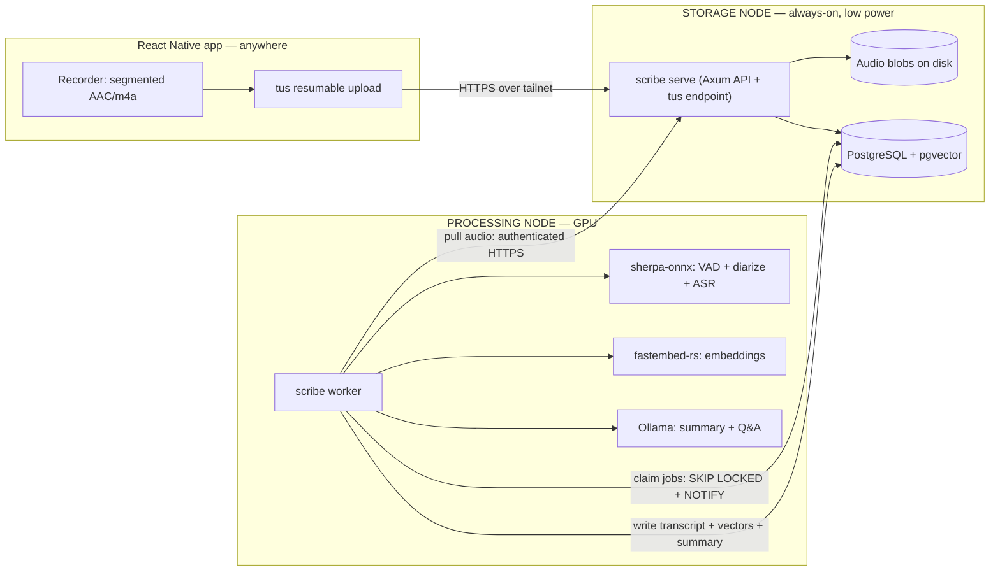
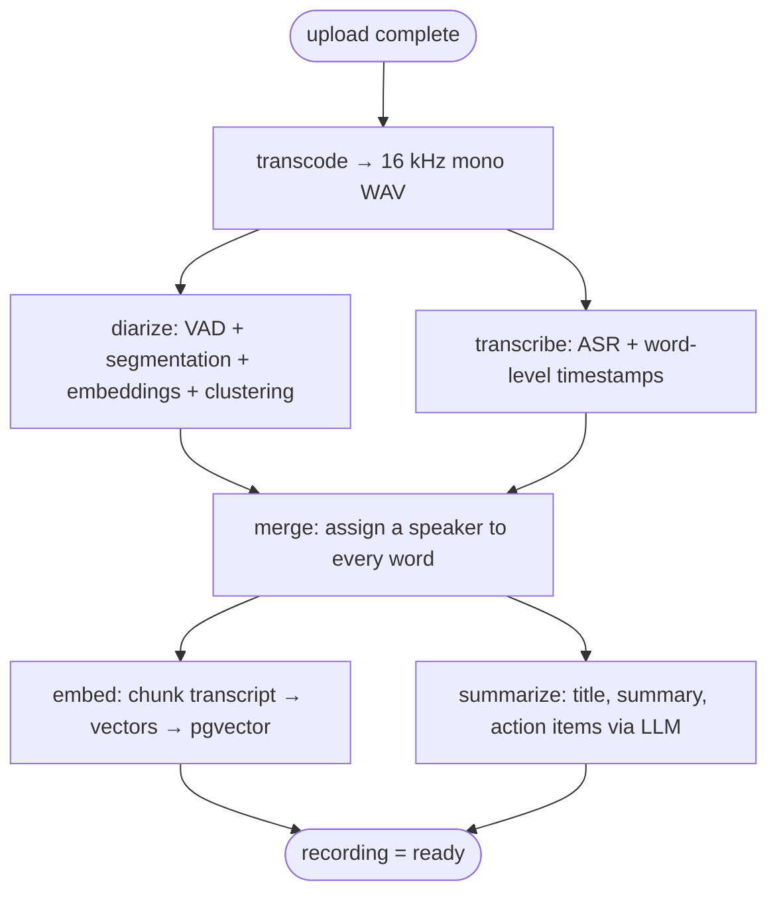

# Scribe — Self‑Hosted Meeting Recording, Transcription & Semantic Index

**Architecture & Design Document — v1.0 (June 2026)**

> *"Scribe" is a placeholder name for the project and the binary. Rename freely.*

This document is a build blueprint, not code. It captures the goals, the system shape, every major technology choice (verified against mid‑2026 reality), the data model, the processing pipeline, the mobile client, security, hardware sizing, and a phased roadmap. The intent is that you (or anyone) could start implementing directly from it.

---

## Table of contents

1. [Goals & non‑goals](#1-goals--non-goals)
2. [Requirements recap & headline decisions](#2-requirements-recap--headline-decisions)
3. [System architecture](#3-system-architecture)
4. [The single binary and its subcommands](#4-the-single-binary-and-its-subcommands)
5. [Remote access & networking](#5-remote-access--networking)
6. [End‑to‑end data flow](#6-end-to-end-data-flow)
7. [Job queue & the processing pipeline](#7-job-queue--the-processing-pipeline)
8. [Transcription & speaker diarization](#8-transcription--speaker-diarization)
9. [LLM indexing & search](#9-llm-indexing--search)
10. [Storage: blobs + database schema](#10-storage-blobs--database-schema)
11. [The mobile app (React Native)](#11-the-mobile-app-react-native)
12. [Security](#12-security)
13. [Hardware sizing & deployment](#13-hardware-sizing--deployment)
14. [Technology choices — summary & rationale](#14-technology-choices--summary--rationale)
15. [Phased build roadmap](#15-phased-build-roadmap)
16. [Open risks & mitigations](#16-open-risks--mitigations)
17. [Appendix](#17-appendix)

---

## 1. Goals & non‑goals

### Goals

- **Record meetings on a phone** and get them off the device reliably, even over flaky networks.
- **Self‑hosted, local models only.** No cloud transcription/LLM APIs. Your audio never leaves hardware you control.
- **Immediate processing.** A recording is transcribed as soon as it lands (or as each chunk lands), not on a nightly batch.
- **Automatic voice detection & speaker labelling** (diarization), with the ability to attach real names to recurring speakers.
- **Searchable / "indexable" by an LLM** — semantic + keyword search across every meeting, plus summaries and ask‑a‑question over the corpus.
- **Split hosting from processing.** One machine *hosts the data* (always‑on, low power). A different machine *does the compute* (GPU). These are clean, separable roles.
- **One program, many roles.** The background workers and the API server are the *same* Rust binary, selected by command‑line arguments.
- **Rust backend.** React Native front end.
- **Reachable from anywhere** without exposing the server to the public internet.

### Non‑goals (for v1)

- Real‑time live captioning during the meeting (we record then process; live streaming is a possible later pivot — see §16).
- Multi‑tenant / multi‑user accounts and sharing. This is a personal system; auth is "is this my device," not a user directory.
- Web front end. The phone is the client. (A read‑only web view is an easy later add since the API already exists.)
- Editing/redacting audio. We store, transcribe, and index — not a DAW.

---

## 2. Requirements recap & headline decisions

Your stated constraints, and what each resolved to:

| Your requirement | Decision |
|---|---|
| Mobile app that records meetings | **React Native** (Expo + dev client) capture client |
| Local models, no cloud | **sherpa‑onnx** (ASR + diarization) + **Ollama** (LLM) + **fastembed‑rs** (embeddings), all on your GPU box |
| Upload to a dedicated server on my own network | **Storage node** runs the Axum API + blob store + Postgres |
| Works from anywhere | **Tailscale** mesh VPN (phone + both servers on one tailnet) |
| Files immediately processed | **Postgres `LISTEN/NOTIFY`** wakes the worker the instant a recording finishes uploading |
| Automatic voice detection & labelling | **All‑Rust diarization** via sherpa‑onnx (Silero VAD → pyannote segmentation → speaker embeddings → clustering), plus optional speaker enrollment for names |
| Host data on one computer, process on another | Two **roles** of the same binary: `serve` (storage) and `worker` (compute), meeting at a shared Postgres + an HTTP audio‑pull API |
| Background processes = same app, different CLI args | **Single Rust binary, subcommands** (`serve`, `worker`, `migrate`, `ingest`, …) |
| Rust backend | **Axum 0.8** on tokio/hyper/rustls; **sqlx** to Postgres |
| Frontend: whatever's best | React Native (per your choice) |

These are explained and justified throughout; §14 is the one‑glance summary table with versions and alternatives.

---

## 3. System architecture

Two physical machines, three logical roles (the phone, the storage node, the processing node), all on one Tailscale tailnet.



**Why this split works cleanly.** Postgres is the single rendezvous point. The storage node owns durable state (audio bytes + database). The processing node owns nothing durable — it claims a job, pulls the audio over HTTPS, runs models, writes results back, and forgets. You can reboot, upgrade, or swap the GPU box at will; nothing is lost. You can also run *zero* or *several* processing nodes — they all just pull from the same queue.

**The storage node** is deliberately humble: a NAS, a mini‑PC, an old laptop, a Raspberry Pi 5 — anything always‑on with disk. It runs Postgres, holds the audio files, and serves the API. No GPU needed.

**The processing node** is where the money goes: a desktop with a consumer GPU (an RTX 3060 12 GB is the practical real‑time floor; a 4070/4080/4090 is comfortable). It can be asleep/off when idle if you don't need instant processing, and woken on demand — or left on for "immediate."

---

## 4. The single binary and its subcommands

Your "background processes are the same app, different CLI args" requirement maps to a classic **monolith‑with‑subcommands** design. One crate, one binary (`scribe`), built once, deployed to both machines. The argument you pass selects the *role*; shared code (config loading, DB pool, models, logging) is common.

Suggested CLI surface (using `clap` derive):

```text
scribe <subcommand> [flags]

  serve        Run the storage node: Axum HTTP API + tus upload endpoint,
               blob storage, job enqueue, search & Q&A API.
                 --config <path>            TOML/env config
                 --bind 0.0.0.0:8443

  worker       Run the processing node: pull jobs, run the pipeline.
                 --stages all|<list>        which job kinds to handle
                                            (transcode,diarize,transcribe,
                                             merge,embed,summarize)
                 --concurrency 1            parallel jobs (GPU = usually 1)
                 --models-dir <path>

  migrate      Apply database migrations (run on the storage node).
                 --to latest

  ingest       Manually ingest an audio file (backfill / testing / desktop
               capture). Creates a recording and enqueues processing.
                 <file> --title "..." --participants 4

  reindex      Recompute derived data over existing recordings.
                 --embeddings               re-embed (e.g. after model change)
                 --summaries                regenerate LLM summaries

  models       Manage local model assets.
                 pull                       download/verify ONNX + LLM models
                 list

  enroll       Register a known speaker's voice for name labelling.
                 --name "Dawson" --audio sample.wav

  speaker      Manage speaker identities (merge, rename, delete).

  doctor       Validate config, DB connectivity, model presence, GPU, Tailscale.
```

**Deployment shape.**

```text
# On the STORAGE node
scribe migrate
scribe serve --config /etc/scribe/storage.toml      # systemd service

# On the PROCESSING node
scribe worker --stages all --concurrency 1          # systemd service
# (or split the pipeline across workers / machines:)
scribe worker --stages transcode,diarize,transcribe
scribe worker --stages embed,summarize
```

**Internal crate layout** (a Cargo workspace keeps the shared core testable and lets the binary stay thin):

```text
scribe/
├─ Cargo.toml                 # workspace
├─ crates/
│  ├─ scribe-core/            # config, db pool, domain types, errors
│  ├─ scribe-db/              # sqlx queries, migrations, queue (SKIP LOCKED)
│  ├─ scribe-api/             # Axum routers, handlers, auth, tus glue
│  ├─ scribe-pipeline/        # transcode, diarize, transcribe, merge, embed, summarize
│  ├─ scribe-asr/             # sherpa-onnx wrappers (ASR + VAD + diarization)
│  ├─ scribe-llm/             # Ollama + embeddings clients
│  └─ scribe-cli/             # clap subcommands → wires the above (this builds `scribe`)
└─ migrations/                # SQL
```

Everything compiles into the one `scribe` binary; `serve` and `worker` just call into different parts of `scribe-pipeline` / `scribe-api`. This is exactly the property you asked for.

---

## 5. Remote access & networking

You let me pick the "works from anywhere" approach. **The recommendation is Tailscale**, and it's the clearest single win in the whole design.

### Why Tailscale

Put the phone **and** both servers on one tailnet (a WireGuard mesh). The app then talks to the storage node by its stable MagicDNS name — `https://scribe.<your-tailnet>.ts.net` — from any network on earth: home Wi‑Fi, LTE, a hotel, a coffee shop. The traffic is end‑to‑end encrypted by WireGuard, and **the server is never exposed to the public internet** — there are no open inbound ports, no port forwarding, no dynamic DNS.

How it compares for *this* use case:

| Option | Setup effort | Public exposure | Works on mobile/CGNAT | Large uploads | Verdict |
|---|---|---|---|---|---|
| **Tailscale** | ~5 min, native iOS/Android apps | **None** — server stays private | **Yes** (coordinated + DERP relay fallback) | **No artificial cap** | ✅ **Chosen** |
| Cloudflare Tunnel | Easy | Public hostname (need Cloudflare Access to lock down) | Yes | **100 MB cap on the free plan** — silently breaks hour‑long uploads | ✗ |
| Plain WireGuard | Manual keys/config; needs port‑forward + DDNS; **breaks under carrier‑grade NAT**; manual reconnect on network switch | None | Often **no** on mobile without your own relay | No cap | ✗ more work, worse mobile UX |
| Port‑forward + DDNS + TLS | Most manual | **Exposes the server publicly** — largest attack surface | Yes (if no CGNAT) | No cap | ✗ |

### Practical notes for the build

- **No Tailscale Funnel needed.** Funnel publishes a service to the *public* internet; you only need it if a client is *off* the tailnet. Your phone is *on* the tailnet, so use plain in‑tailnet access. Not using Funnel keeps exposure at zero.
- **Use HTTPS, not cleartext.** WireGuard already encrypts the tunnel, but mobile OSes dislike cleartext HTTP (iOS App Transport Security; Android cleartext policy). Rather than add ATS exceptions, terminate TLS properly. The clean path: `tailscale cert` / `tailscale serve` provisions a **publicly‑trusted Let's Encrypt certificate for your `*.ts.net` name** (via DNS‑01, auto‑renewing). The phone trusts it out of the box — no custom CA to install. Point the app at `https://scribe.<tailnet>.ts.net`.
  - Two ways to wire TLS: let **`tailscale serve`** terminate TLS and reverse‑proxy to `scribe serve` on localhost, **or** terminate TLS inside Axum with **rustls** using the `tailscale cert` files. Either is fine; `tailscale serve` is less code.
- **Enable MagicDNS** so the app resolves the hostname. (Fallback: hard‑code the `100.x.y.z` tailnet IP — works, but brittle if it changes.)
- **Relay reality:** ~5% of connections fall back to DERP relays (~35 Mbps, +20–50 ms). For tens of MB of compressed audio that's a non‑issue.
- **The processing node reaches Postgres and the audio API over the same tailnet** — so the two‑machine split needs no public networking at all, even between the servers.

---

## 6. End‑to‑end data flow

```mermaid
sequenceDiagram
  participant P as Phone (RN)
  participant S as scribe serve (storage)
  participant Q as Postgres (state + queue)
  participant W as scribe worker (GPU)

  P->>S: POST /recordings (title, expected participants)
  S->>Q: insert recording (status = uploading)
  S-->>P: recording_id + upload target

  loop every 30–60s segment, while recording
    P->>S: tus PATCH (resumable segment upload)
    S->>Q: insert/append segment row
  end

  P->>S: POST /recordings/{id}/complete
  S->>Q: enqueue job(transcode); pg_notify('jobs')
  Note over W: woken by NOTIFY (or 5s poll backstop)
  W->>Q: claim job (FOR UPDATE SKIP LOCKED)
  W->>S: GET audio segments (authenticated)
  W->>W: transcode → diarize + transcribe → merge → embed → summarize
  W->>Q: write transcript, speakers, vectors, summary; mark recording = ready
  P->>S: GET /recordings/{id}
  S-->>P: transcript + speaker labels + summary
```

**"Immediate processing."** Two levers make it feel instant:

1. **Segmented upload while recording.** The phone records in 30–60 s chunks and uploads each as it closes (see §11). By the time the meeting ends, almost everything is already on the server.
2. **`LISTEN/NOTIFY`.** `complete` enqueues a job and fires a Postgres `NOTIFY`; an idle worker is sleeping on `LISTEN` and wakes immediately — no polling latency. (A low‑frequency poll remains as a safety net, since `NOTIFY` is best‑effort and isn't redelivered across a dropped connection.)

*Optional later optimization:* process **per chunk** as chunks arrive (partial transcripts mid‑meeting). The data model supports it, but v1 processes the whole recording on `complete` — simpler and gives diarization the full audio (better speaker clustering).

---

## 7. Job queue & the processing pipeline

### The queue

A dedicated broker (Redis/NATS) is unnecessary for a single‑user system and adds a second stateful thing to operate. **Postgres is the queue**, using the well‑worn `SELECT … FOR UPDATE SKIP LOCKED` pattern (the same mechanism under Oban, Que, Solid Queue) plus `LISTEN/NOTIFY` for instant wakeups. This is still the recommended, race‑free, deadlock‑free approach in 2026.

A worker claims work atomically:

```sql
UPDATE jobs SET state = 'running', locked_by = $1, locked_at = now()
WHERE id = (
  SELECT id FROM jobs
  WHERE state = 'queued' AND kind = ANY($2)         -- this worker's stages
    AND run_after <= now()
  ORDER BY priority DESC, created_at
  FOR UPDATE SKIP LOCKED
  LIMIT 1
)
RETURNING *;
```

**Implementation options**, in order of preference for this project:

- **Hand‑rolled** (~40 lines around the query above): lowest dependency, full control, perfectly adequate for one user. Recommended for v1.
- **`apalis`** (Postgres backend): the popular Rust job framework — retries, backoff, cron, worker management for free. Good if you'd rather not own that plumbing.
- **`pgmq`** (Rust client for the pgmq Postgres extension): SQS‑like semantics living in SQL, usable from other languages too.
- **Avoid `sqlxmq`** — it appears in many "Rust Postgres queue" lists but has been effectively unmaintained since 2023.

**Crash recovery / "immediate" without losing jobs.** Long jobs must not rely on holding a row lock for the whole run (that pins vacuum and dies with the connection). Instead:

- Claim fast inside a short transaction (set `state = running`, stamp `locked_at`/`locked_by`), then **do the heavy work outside the transaction**.
- A **visibility timeout / heartbeat**: the worker periodically bumps `locked_at`. A reaper requeues any `running` job whose `locked_at` is older than, say, 3× the heartbeat interval — so a worker that dies mid‑transcription gets its job retried elsewhere.
- Bounded retries with exponential backoff via `run_after`; after N attempts, move to `state = failed` with the captured error for inspection.

### The pipeline (job DAG)

Each recording flows through stages. Modeling them as **separate jobs** (rather than one monolithic "process" job) gives per‑stage retry granularity and lets diarize/transcribe run in parallel.



- **transcode** — concatenate the uploaded AAC segments in sequence order and decode to the 16 kHz mono WAV the models want (via an `ffmpeg`/`symphonia` step). Cheap.
- **diarize** and **transcribe** both consume the WAV and are independent → run concurrently.
- **merge** waits on both, then assigns each transcribed word to the overlapping speaker turn (§8).
- **embed** and **summarize** both consume the merged transcript → run concurrently.
- A stage enqueues its successors on completion; a small `job_deps` check (or counting completed predecessors) gates `merge`.

On a single‑GPU worker you'll typically run `--concurrency 1` so the GPU isn't oversubscribed; the parallelism above is logical (stages still serialize on the one GPU) but lets you spread stages across multiple workers/machines later.

---

## 8. Transcription & speaker diarization

This is the heart of "local models" and "automatic voice detection and labelling," and it's where 2025–2026 changed things in your favor.

### One Rust dependency for the whole speech pipeline

> **Important 2026 correction:** the widely‑referenced `sherpa-rs` binding is now **deprecated** — its own README points to the upstream. Use the **official `sherpa-onnx` Rust crate** (v1.13.x on crates.io, maintained by the k2‑fsa lead). Some docs pages still link the old example; ignore those.

The official `sherpa-onnx` crate exposes, with safe RAII types, **everything** you need from one place:

- `VoiceActivityDetector` (Silero VAD, and the newer Ten VAD) — strips silence/non‑speech.
- `OfflineSpeakerDiarization` — segmentation + speaker embeddings + clustering.
- `OfflineRecognizer` — ASR (Whisper, **Parakeet**, Canary, Moonshine, SenseVoice, …).
- `SpeakerEmbeddingExtractor` / `SpeakerEmbeddingManager` — for enrollment & stable identity.

So **VAD + diarization + ASR run in‑process from Rust, no Python.** That is a genuinely viable all‑Rust path now, not a hack.

### Diarization pipeline (all ONNX)

1. **VAD** — Silero VAD (ONNX) emits speech segments; removes silence so the models don't waste compute or hallucinate text on dead air.
2. **Segmentation** — `pyannote-segmentation-3.0` exported to ONNX (or the newer `reverb-diarization-v1`) finds speaker‑change boundaries.
3. **Speaker embeddings** — a 3D‑Speaker / NeMo TitaNet / WeSpeaker extractor turns each segment into a voice vector (int8 variants available).
4. **Clustering** — `FastClustering` groups segments into speakers. Pass a **known participant count** when you have it (much more accurate); otherwise use a cosine‑similarity threshold to discover the count.

**Accuracy expectations:** roughly **8–15% diarization error rate** out of the box on meeting audio (cleaner audio does better). The main weaknesses are **overlapping speech** (clustering under‑detects simultaneous talkers) and **unknown speaker count** — both mitigated by letting the user enter the number of participants in the app.

### ASR model choice

| Model | Why pick it |
|---|---|
| **Parakeet‑TDT‑0.6B‑v3** (recommended default) | Tops the 2026 open ASR leaderboard for accuracy *and* speed; multilingual (25 EU langs, auto‑detect); **word‑level timestamps**; runs as ONNX inside the same `sherpa-onnx` crate (so ASR and diarization share one dependency). Extremely fast on GPU. |
| **Whisper large‑v3‑turbo** | Best multilingual robustness; pick it if your meetings are linguistically messy. Runs in sherpa‑onnx, or in **whisper.cpp via `whisper-rs` v0.16** if you want whisper.cpp's hand‑tuned CUDA/Vulkan/Metal/ROCm kernels and DTW token timestamps. |
| **candle** Whisper | Pure‑Rust, no C++ link step. Slower, weaker timestamps. A fallback for build‑purity. |

### Producing a speaker‑labelled transcript (the merge)

Use the **WhisperX pattern (approach A):** run ASR over the *whole* file to get word‑level timestamps, run diarization independently to get speaker turns, then **assign each word the speaker whose turn maximally overlaps the word's `[start, end]`.** This keeps full context for ASR (better text and punctuation) and lets diarize/transcribe run in parallel. The merge is a ~50‑line interval‑overlap → argmax function in Rust; there's no crate that does it for you, but it's trivial.

(The alternative — segment first, transcribe each chunk — yields worse text because short clips lose context and Whisper hallucinates on tiny inputs. Don't.)

### Naming speakers (enrollment)

Diarization gives anonymous, per‑recording labels (`Speaker 0`, `Speaker 1`). To turn those into **names**:

- **`scribe enroll --name "Dawson" --audio sample.wav`** stores a reference voice embedding in a `speakers` table.
- After diarization, compare each recording's speaker embedding against enrolled embeddings (cosine similarity, `SpeakerEmbeddingManager`). Above a threshold → auto‑label with the known name; otherwise leave as `Speaker N` and let the user name them in the app (which can *also* enroll that voice for next time).
- Persist per‑recording embeddings so identity stays stable and improves as you label more.

### Word‑timestamp precision caveat & escape hatch

All‑Rust word timestamps (sherpa, or whisper.cpp DTW) are good but **less precise than WhisperX's wav2vec2 forced alignment (±~50 ms).** For reading transcripts and tap‑to‑play this is fine. If you later find the alignment too coarse, the pragmatic escape hatch is a **faster‑whisper / WhisperX Python sidecar** the worker shells out to — it gives forced‑aligned word timestamps + integrated diarization. The architecture allows it (the worker already orchestrates external tools); v1 stays all‑Rust.

---

## 9. LLM indexing & search

"Indexable using an LLM" = three capabilities: **semantic search**, **summaries/metadata**, and **ask‑questions‑over‑meetings (RAG)**. All run locally on the processing node.

### Embeddings & the vector index

- **Embeddings:** **fastembed‑rs** in‑process (ONNX via the `ort` crate) is the simplest path — embedding models are tiny and run fine on CPU, so the worker just embeds transcript chunks itself. (If you later want one shared GPU‑served model, stand up **TEI** or **Infinity** and call it over HTTP — a trivial swap.)
- **Model:** **Qwen3‑Embedding‑0.6B** (1024‑dim, 32K context, strong multilingual) is the recommended quality pick; **nomic‑embed‑text** (768‑dim) is the safe lightweight default. *The dimension is a schema commitment* — choose before sizing the pgvector column; changing models later means a re‑embed migration (`scribe reindex --embeddings`).
- **Vector store:** **pgvector** in the same Postgres (HNSW index; current line 0.8.x). Since Postgres is already the backbone, this keeps the whole system at *one* stateful service and — crucially — lets you do **hybrid queries** in a single statement: vector KNN *plus* SQL filters on date, participant, folder, etc. Use `halfvec` (16‑bit) to halve index size at negligible recall loss, and enable `hnsw.iterative_scan` since you'll filter a lot. A dedicated vector DB (Qdrant, LanceDB) is unnecessary at personal‑corpus scale; pgvector matches or beats them there.

**Chunking:** split the transcript by **speaker turn and/or a sliding time window** (e.g. ~30–60 s or ~512 tokens with overlap), store each chunk's text + `start_ms`/`end_ms` + speaker + embedding. This makes search results jump to the exact moment, and gives RAG well‑scoped context.

### Summaries & metadata

- **Serving:** **Ollama** on the processing node — one‑line install, OpenAI‑compatible API on `:11434`, auto model load/unload. Its only real weakness is concurrency, which is moot here because the worker processes jobs serially. (Upgrade path: **llama.cpp server** for ~10–20% more speed, or **vLLM** if you ever add concurrency/bulk backfill — note vLLM pre‑grabs ~90% of VRAM, heavy for an idle single‑user box.)
- **Model by VRAM tier:** 8 GB → an 8–12B instruct model at Q4 (Llama 3.x 8B, Qwen3 8B, Gemma 3 12B, Phi‑4 14B); 24 GB → a ~27B at Q4 (Gemma 3 27B / Qwen3‑class) with room for a long‑context KV cache. Summarization/Q&A isn't demanding — long‑context capability matters more than raw size.
- On `summarize`, generate and store: **title**, **abstract/summary**, **action items**, **decisions**, **topics/tags**, and optionally a **per‑speaker recap**. The Rust `scribe-llm` crate just POSTs to Ollama's OpenAI‑compatible endpoint.

### Search & Q&A API

- **Hybrid search:** combine Postgres full‑text (`tsvector`, exact/keyword) with pgvector semantic similarity, fused (e.g. Reciprocal Rank Fusion). Endpoint: `GET /search?q=…&from=…&speaker=…`.
- **Ask (RAG):** `POST /ask {question}` → embed the question → retrieve top‑k chunks from pgvector (optionally filtered) → stuff into the LLM context → return an answer **with citations** (links back to recording + timestamp). Even the 8–12B tier answers well over retrieved context.

---

## 10. Storage: blobs + database schema

### Blob storage (the audio)

**v1: store audio as files on the storage node's disk, served through the API.** Simplest possible; the storage node already owns the bytes. Serve with HTTP range requests (for scrub/seek playback) and short‑lived signed URLs for the worker to pull. Keep audio **out of Postgres** (a `bytea` blob store bloats the DB and wrecks vacuum) — the DB holds only a storage key + metadata + transcript + vectors.

**If/when you want S3 semantics** (presigned URLs, multipart, lifecycle, a clean network boundary between nodes), add **Garage** — a single small Rust binary, S3‑compatible, explicitly aimed at small self‑hosted setups. **Do not reach for MinIO:** its community edition entered maintenance mode in late 2025 and the repo was archived Feb 2026. (SeaweedFS is the alternative if you ever expect millions of objects.)

**Layout on disk:**

```text
/var/lib/scribe/blobs/
  {recording_id}/
    segments/000001.m4a 000002.m4a …     # raw uploaded chunks
    audio.wav                            # transcoded 16k mono (cache; regenerable)
```

### Database schema (Postgres)

A sketch — enough to build from, not exhaustive:

```sql
-- A captured meeting
CREATE TABLE recordings (
  id              uuid PRIMARY KEY DEFAULT gen_random_uuid(),
  title           text,
  created_at      timestamptz NOT NULL DEFAULT now(),
  device_id       text,
  duration_ms     bigint,
  status          text NOT NULL DEFAULT 'uploading',   -- uploading|processing|ready|failed
  participants_expected int,                           -- helps diarization
  audio_format    text,            -- e.g. 'aac'
  sample_rate     int,
  storage_key     text             -- path/key prefix in the blob store
);

-- Chunked-upload pieces (the tus/segment story)
CREATE TABLE segments (
  id            uuid PRIMARY KEY DEFAULT gen_random_uuid(),
  recording_id  uuid NOT NULL REFERENCES recordings(id) ON DELETE CASCADE,
  seq           int  NOT NULL,
  storage_key   text NOT NULL,
  start_ms      bigint,
  duration_ms   bigint,
  bytes         bigint,
  sha256        bytea,
  uploaded_at   timestamptz NOT NULL DEFAULT now(),
  UNIQUE (recording_id, seq)
);

-- The work queue
CREATE TABLE jobs (
  id            bigserial PRIMARY KEY,
  recording_id  uuid REFERENCES recordings(id) ON DELETE CASCADE,
  kind          text NOT NULL,        -- transcode|diarize|transcribe|merge|embed|summarize
  state         text NOT NULL DEFAULT 'queued',  -- queued|running|done|failed
  priority      int  NOT NULL DEFAULT 0,
  attempts      int  NOT NULL DEFAULT 0,
  run_after     timestamptz NOT NULL DEFAULT now(),
  locked_by     text,
  locked_at     timestamptz,
  payload       jsonb,
  error         text,
  created_at    timestamptz NOT NULL DEFAULT now(),
  updated_at    timestamptz NOT NULL DEFAULT now()
);
CREATE INDEX ON jobs (state, kind, run_after);

-- Known/enrolled speakers (cross-recording identity)
CREATE TABLE speakers (
  id            uuid PRIMARY KEY DEFAULT gen_random_uuid(),
  display_name  text NOT NULL,
  embedding     vector(192),     -- speaker-embedding dim (model dependent)
  created_at    timestamptz NOT NULL DEFAULT now()
);

-- Per-recording diarization result + mapping to known speakers
CREATE TABLE recording_speakers (
  recording_id  uuid NOT NULL REFERENCES recordings(id) ON DELETE CASCADE,
  local_idx     int  NOT NULL,        -- 'Speaker 0' within this recording
  speaker_id    uuid REFERENCES speakers(id),  -- null until named/matched
  embedding     vector(192),
  PRIMARY KEY (recording_id, local_idx)
);

-- The transcript: one row per utterance/turn
CREATE TABLE utterances (
  id            bigserial PRIMARY KEY,
  recording_id  uuid NOT NULL REFERENCES recordings(id) ON DELETE CASCADE,
  local_idx     int,                  -- which diarized speaker
  start_ms      bigint NOT NULL,
  end_ms        bigint NOT NULL,
  text          text   NOT NULL,
  words         jsonb,                -- [{w,start_ms,end_ms,conf}, …]
  tsv           tsvector              -- for keyword search
);
CREATE INDEX ON utterances USING gin (tsv);

-- Retrieval chunks for semantic search / RAG
CREATE TABLE chunks (
  id            bigserial PRIMARY KEY,
  recording_id  uuid NOT NULL REFERENCES recordings(id) ON DELETE CASCADE,
  start_ms      bigint, end_ms bigint,
  text          text NOT NULL,
  embedding     halfvec(1024)         -- match your embedding model's dim
);
-- Build HNSW after choosing the model:
-- CREATE INDEX ON chunks USING hnsw (embedding halfvec_cosine_ops);

-- LLM-generated metadata
CREATE TABLE summaries (
  recording_id  uuid PRIMARY KEY REFERENCES recordings(id) ON DELETE CASCADE,
  title         text,
  summary       text,
  action_items  jsonb,
  topics        jsonb,
  model         text,
  created_at    timestamptz NOT NULL DEFAULT now()
);
```

---

## 11. The mobile app (React Native)

The phone's one hard job is **capture the meeting and get every second of it to the server, reliably.** Everything else (viewing transcripts, search) is comparatively easy because the server API already does the heavy lifting.

### Stack

- **Expo with a dev client + config plugins** (the 2026 mainstream — you no longer "eject"; you prebuild with native modules). Drop to bare/custom native only for the recording core if testing demands it.
- **Recording module:** start with **`expo-audio`** (the actively‑maintained replacement for the deprecated `expo-av`; has an `enableBackgroundRecording` option). If hour‑plus **Android background** recording proves fiddly (it can be, see below), switch the recording core to **`react-native-nitro-sound`** — the actively‑maintained successor to the now‑deprecated `react-native-audio-recorder-player`, built on Nitro Modules — and wire the foreground service yourself for full control.
- **Networking/VPN:** the Tailscale app on the phone (the app just calls `https://scribe.<tailnet>.ts.net`).

### Recording engine

- **Format:** **AAC in m4a, 16 kHz mono, ~24–32 kbps.** Natural and hardware‑accelerated on both platforms, tiny to upload, and transcodes cleanly to the 16 kHz mono WAV the ASR wants with no accuracy loss. (Opus is marginally more efficient but AAC is the path of least resistance; avoid uploading raw WAV/FLAC — 10–20× larger.)
- **Segmented capture (key design choice):** record in **fixed 30–60 s segments**. Benefits: each closed segment uploads immediately while recording continues (low latency, "immediate processing"); a crash/interruption loses at most one segment; it plays naturally into resumable upload and (later) incremental server‑side ASR. The server stitches by sequence number.
- **iOS background:** set `UIBackgroundModes: [audio]` — recording then continues when backgrounded or screen‑locked. **Handle `AVAudioSession` interruptions** (calls, Siri): on interruption it pauses; resume only if you were recording, and segmenting makes the resume clean. Note you generally **cannot *start* a recording while already backgrounded** — start in the foreground, then background.
- **Android background:** a **foreground service is mandatory**, and on Android 14+ you **must** declare `foregroundServiceType="microphone"` (+ `FOREGROUND_SERVICE_MICROPHONE` permission) — otherwise the app is rejected/crashes. A persistent "Recording…" notification keeps it alive indefinitely and survives Doze. Same rule as iOS: **can't start mic capture from the background** — start in the foreground.

### Upload

- **Protocol: tus** (resumable upload). It handles resume‑from‑offset, retries, and chunking — exactly what hour‑long uploads over flaky mobile networks need.
- **Server side:** run **`rustus`** (actively‑maintained async‑Rust tus server) as a sidecar next to `scribe serve`, reverse‑proxied at `/files`. Its **completion hook** calls back into `scribe serve` to record the finished segment. (Alternatively, implement tus or plain chunked multipart directly on Axum — but remember Axum's **2 MB default body limit** must be raised, and prefer streaming to disk over buffering. tus buys you free resume; recommended.)
- **Client side:** **`tus-js-client` v4** is the simplest and works in RN — but being pure‑JS it only progresses while the app is alive (fine if uploads happen *during* recording, when the foreground service / audio background mode keeps the app running). If you need uploads to **continue after the OS suspends the app**, use the native‑backed **`@cuvent/react-native-better-tus-client`** (hands the transfer to URLSession/WorkManager). Avoid `react-native-background-upload` (stale, not resumable).

### Screens (minimal v1)

1. **Record** — big record button, live timer, segment/upload indicator, a field for *expected participant count* (feeds diarization), optional title.
2. **Library** — list of recordings with status (uploading / processing / ready) and upload progress; offline‑first (records with no connectivity, uploads when back on the tailnet).
3. **Recording detail** — speaker‑labelled transcript, tap‑a‑line to play that moment, the LLM summary + action items, in‑recording search.
4. **Search** — global hybrid search across all meetings; results deep‑link to the moment.
5. **Ask** — natural‑language question over the whole corpus (RAG), answers with citations.
6. **Settings** — server URL (the tailnet MagicDNS name), API key, audio quality, default participant count.

---

## 12. Security

- **No public exposure.** The server lives only on the tailnet (§5); there are no inbound ports on the public internet. This removes the entire class of "someone on the internet attacks my recorder."
- **Tailscale ACLs** restrict *which* tailnet devices may reach the storage node (just your phone + the processing node).
- **App‑level auth** as defense‑in‑depth: a per‑device API key / bearer token on every API call, independent of the VPN. (A device‑enrollment flow issues the token once.)
- **TLS everywhere the app speaks**, via `tailscale serve` or rustls with a `tailscale cert` Let's Encrypt cert — so even inside the encrypted tunnel the app uses HTTPS and you sidestep mobile cleartext‑traffic restrictions.
- **Postgres** is reachable only on the tailnet, with a scoped role for the worker and TLS on the connection; short‑expiry signed URLs for audio pulls.
- **At rest (optional):** full‑disk encryption on the storage node, and/or encrypt audio blobs with a key the storage node holds. Note for yourself: transcripts of meetings can be sensitive — back them up encrypted.
- **Backups:** `pg_dump` (or PITR) for the database + a copy of the blob directory. The DB is the source of truth for everything except the audio bytes.

---

## 13. Hardware sizing & deployment

**Storage node (data host).** Modest and always‑on. Any of: a NAS, a mini‑PC (N100‑class), an old laptop, a Raspberry Pi 5. Needs disk for audio (AAC at ~32 kbps ≈ ~14 MB/hour of meeting — years of meetings fit on a small SSD) and Postgres. No GPU. Low idle power so it can stay on 24/7.

**Processing node (compute).**

- **GPU path (recommended for "immediate"):** a desktop with a consumer NVIDIA GPU. **RTX 3060 12 GB** is the practical real‑time floor; **RTX 4070 12 GB / 4080 / 4090** is comfortable. A 1‑hour meeting transcribes in well under a minute on a 4090 (Parakeet faster still); diarization adds seconds‑to‑low‑minutes. 12 GB VRAM holds large‑v3‑turbo + diarization; 24 GB also fits a 27B summarization LLM with long context. Can sleep when idle and wake on demand, or stay on for instant turnaround.
- **CPU‑only path (works, slower):** an 8–16‑core box handles Parakeet or Whisper small/medium, or large‑v3‑turbo INT8, at faster‑than‑real‑time; full large‑v3 is ~2.5× slower than real time on CPU (fine for overnight batch, not interactive). Diarization is cheap on CPU regardless.

**Co‑location note:** if the same GPU serves both the LLM (Ollama) and a GPU embeddings server, budget VRAM — Ollama's load/unload shares a card gracefully; vLLM's 90% pre‑grab would starve a co‑located embedder. v1 keeps embeddings on CPU (fastembed‑rs), sidestepping this.

**Both nodes** run their `scribe` role as a **systemd service**; the processing node also runs **Ollama** as a service. Tailscale runs on all three devices.

---

## 14. Technology choices — summary & rationale

| Concern | Choice | Version / model (mid‑2026) | Why / alternatives |
|---|---|---|---|
| Backend language | Rust | — | Your call; great fit for a long‑running daemon + models |
| Web framework | **Axum** | 0.8.x (tokio/hyper/tower) | Mainstream, streams large uploads; rustls TLS. Alt: actix‑web, poem. *0.8 changed route syntax to `/{id}`; raise `DefaultBodyLimit`.* |
| DB / state / queue | **PostgreSQL** | 16/17/18 | One store for jobs + transcripts + vectors. `SKIP LOCKED` + `LISTEN/NOTIFY`. |
| Queue impl | hand‑rolled SKIP LOCKED | — | Lowest‑dep. Alts: **apalis**, **pgmq**. *Avoid sqlxmq (stale).* |
| Blob store | **filesystem + API** | — | Simplest. S3 later: **Garage** (Rust). *MinIO archived Feb 2026 — don't.* |
| Vector search | **pgvector** | 0.8.x, HNSW, `halfvec` | Hybrid SQL+vector in one store. Alt: Qdrant only at large scale. |
| Embeddings | **fastembed‑rs** (in‑proc ONNX) | Qwen3‑Embedding‑0.6B (1024‑d) or nomic‑embed‑text (768‑d) | Tiny, CPU‑fine. GPU‑served alt: TEI/Infinity. |
| ASR + diarization + VAD | **sherpa‑onnx** (official Rust crate) | 1.13.x | One dep for VAD+diarize+ASR, no Python. *Use the official crate, not deprecated `sherpa-rs`.* |
| ASR model | **Parakeet‑TDT‑0.6B‑v3** | (or Whisper large‑v3‑turbo) | Top accuracy+speed, word timestamps, multilingual. whisper.cpp via **whisper-rs 0.16** for best Whisper GPU kernels. |
| Word‑timestamp escape hatch | faster‑whisper / WhisperX sidecar | — | Only if all‑Rust alignment is too coarse (±50 ms forced alignment). |
| LLM serving | **Ollama** | OpenAI‑compatible | Easiest; serial is fine for one user. Alts: llama.cpp server, vLLM. |
| LLM model | Gemma 3 / Qwen3 class | 8–12B Q4 (8 GB) … 27B Q4 (24 GB) | Summaries/Q&A aren't demanding; long context > size. |
| Mobile | **React Native + Expo** (dev client) | expo‑audio or **react‑native‑nitro‑sound** | *`react-native-audio-recorder-player` deprecated.* |
| Upload | **tus** | **rustus** server + **tus‑js‑client** v4 (or `@cuvent/react-native-better-tus-client`) | Resumable; survives flaky mobile. *Avoid react‑native‑background‑upload.* |
| Remote access | **Tailscale** | — | Private, from‑anywhere, no open ports, no upload cap. TLS via `tailscale serve`/`cert`. |
| TLS | rustls / tailscale cert | Let's Encrypt `*.ts.net` | Publicly‑trusted cert, no custom CA on the phone. |

---

## 15. Phased build roadmap

Each phase is independently testable and leaves you with something that works.

**Phase 0 — Foundations.**
Cargo workspace + `scribe` binary skeleton with `clap` subcommands; config loading; `migrate` + initial schema; Postgres up on the storage node; Tailscale on all three devices with MagicDNS + a `tailscale cert`. *Done when `scribe doctor` passes on both nodes.*

**Phase 1 — Capture → upload → store (no ML yet).**
RN app records segmented AAC with working iOS background mode + Android microphone foreground service; tus upload via rustus; `scribe serve` stores segments, finalizes on `complete`, transcodes to WAV. *Done when an hour‑long recording reliably lands on the server as an ordered, playable file — including across a network drop and an incoming phone call.*

**Phase 2 — Transcription.**
`scribe worker` + sherpa‑onnx ASR (Parakeet or Whisper) with word timestamps; queue with NOTIFY wakeups; transcript stored and viewable in the app. *Done when finishing a recording yields a readable transcript within ~a minute (GPU).*

**Phase 3 — Diarization + speaker labels.**
Add VAD + diarization + the merge; "Speaker N" labels in the transcript; `scribe enroll` + naming UI so recurring voices get real names. *Done when a 3‑person meeting shows correct, nameable speaker turns.*

**Phase 4 — LLM indexing & search.**
Embeddings → pgvector; chunking; hybrid search endpoint; LLM summaries/action items via Ollama; RAG `/ask` with citations; Search + Ask screens. *Done when you can search and ask questions across multiple meetings and jump to the cited moment.*

**Phase 5 — Hardening & polish.**
Visibility‑timeout/heartbeat + retries; multi‑worker / split‑stage workers; observability (structured logs, a `/health` + job dashboard); model management (`scribe models pull`); backups; optional Garage migration; optional per‑chunk live processing. *Done when it survives crashes, reboots, and a week of daily use without babysitting.*

---

## 16. Open risks & mitigations

- **iOS background recording is constrained.** Can't start while backgrounded; calls interrupt the mic. → Start in foreground; handle `AVAudioSession` interruptions; **segmented capture** makes resumes lossless.
- **Android 14+ foreground‑service rules are strict.** Wrong/absent `foregroundServiceType=microphone` → rejection/crash. → Declare it; test on a real device, not just an emulator.
- **`expo-audio` Android background path is rough** (works, but under‑documented; needs specific flags + a foreground service). → If it fights you, move the recording core to `react-native-nitro-sound` with hand‑wired FGS.
- **Diarization struggles with overlapping speech and unknown speaker counts.** → Collect the **expected participant count** in the app; accept that heavy cross‑talk degrades labels; consider an end‑to‑end overlap‑aware model (e.g. Sortformer) later.
- **All‑Rust word timestamps are coarser than forced alignment.** → Fine for reading/seek; faster‑whisper/WhisperX **sidecar** is the escape hatch if needed.
- **`tus-js-client` pauses when the app is suspended.** → Upload during recording (app alive); use the native‑backed tus client if you need post‑suspend continuation.
- **`NOTIFY` is best‑effort.** → Keep a low‑frequency poll backstop; reaper requeues stuck `running` jobs.
- **GPU VRAM contention** if LLM + embeddings co‑locate. → v1 embeds on CPU; if you GPU‑serve embeddings, prefer Ollama's load/unload over vLLM's pre‑grab, and budget VRAM.
- **Embedding‑model dimension is a schema lock‑in.** → Choose before sizing the pgvector column; `scribe reindex --embeddings` to migrate.
- **Ecosystem drift to watch:** MinIO is archived (use Garage); `sherpa-rs`, `react-native-audio-recorder-player`, `sqlxmq`, `expo-av`, and `react-native-background-upload` are deprecated/stale — the choices above route around all of them. Re‑verify versions at build time.
- **Single‑GPU = serial processing.** Fine for personal volume; if you record many long meetings back‑to‑back, add a second worker/GPU (the queue already supports it) or split stages across machines.

---

## 17. Appendix

### A. Example CLI session

```bash
# --- storage node ---
scribe migrate --to latest
scribe serve  --config /etc/scribe/storage.toml     # behind `tailscale serve` TLS

# --- processing node ---
scribe models pull                                  # fetch ONNX (VAD/seg/embed/ASR) + ensure Ollama models
scribe worker --stages all --concurrency 1

# --- utilities (either node) ---
scribe ingest ./offsite.m4a --title "Q3 offsite" --participants 5
scribe enroll --name "Dawson" --audio ./dawson_sample.wav
scribe reindex --embeddings                         # after switching embedding models
scribe doctor                                        # config, DB, models, GPU, tailnet
```

### B. Example config (TOML, role‑shared)

```toml
# /etc/scribe/storage.toml  (serve)            # /etc/scribe/compute.toml (worker)
[database]                                      [database]
url = "postgres://scribe@scribe.tailnet.ts.net/scribe?sslmode=require"

[storage]                                       [worker]
blobs = "/var/lib/scribe/blobs"                 stages = ["all"]
                                                concurrency = 1
[api]                                           models_dir = "/var/lib/scribe/models"
bind = "127.0.0.1:8443"   # tailscale serve fronts it
tus_upstream = "http://127.0.0.1:1080"  # rustus

[auth]                                          [llm]
device_keys = "/etc/scribe/devices.toml"        ollama_url = "http://127.0.0.1:11434"
                                                summarize_model = "gemma3:27b"
[asr]                                            embed_model = "Qwen3-Embedding-0.6B"
model = "parakeet-tdt-0.6b-v3"
diarization = true
```

### C. Key sources (verified June 2026)

**Speech / ASR / diarization**
- sherpa‑onnx official Rust crate (API: ASR + diarization + VAD): https://crates.io/crates/sherpa-onnx · https://docs.rs/sherpa-onnx
- `sherpa-rs` deprecation notice: https://github.com/thewh1teagle/sherpa-rs
- sherpa‑onnx diarization (pyannote + 3D‑Speaker/NeMo + clustering): https://k2-fsa.github.io/sherpa/onnx/speaker-diarization/index.html
- whisper‑rs 0.16: https://crates.io/crates/whisper-rs · whisper.cpp: https://github.com/ggml-org/whisper.cpp
- Parakeet‑TDT‑0.6B‑v3: https://huggingface.co/nvidia/parakeet-tdt-0.6b-v3
- 2026 open ASR benchmarks: https://northflank.com/blog/best-open-source-speech-to-text-stt-model-in-2026-benchmarks
- WhisperX (merge pattern): https://github.com/m-bain/whisperX · faster‑whisper: https://github.com/SYSTRAN/faster-whisper

**Data / queue / LLM**
- Postgres SKIP LOCKED queue: https://www.netdata.cloud/academy/update-skip-locked/
- apalis: https://crates.io/crates/apalis · pgmq: https://crates.io/crates/pgmq
- MinIO maintenance/alternatives (Garage/SeaweedFS): https://blog.elest.io/minio-is-in-maintenance-mode-your-guide-to-s3-compatible-storage-alternatives/
- pgvector 0.8 (iterative scans, halfvec): https://www.thenile.dev/blog/pgvector-080
- fastembed‑rs: https://crates.io/crates/fastembed · embedding model guide: https://milvus.io/blog/choose-embedding-model-rag-2026.md
- Ollama vs llama.cpp vs vLLM: https://codersera.com/blog/ollama-vs-lm-studio-vs-vllm-vs-llama-cpp-vs-mlx-2026/

**Mobile / upload / networking**
- react‑native‑nitro‑sound (successor to deprecated recorder‑player): https://github.com/hyochan/react-native-nitro-sound
- expo‑audio: https://docs.expo.dev/versions/latest/sdk/audio/
- Android 14 foreground‑service types: https://developer.android.com/about/versions/14/changes/fgs-types-required
- tus + rustus: https://tus.io/implementations · https://github.com/s3rius/rustus
- tus‑js‑client: https://www.npmjs.com/package/tus-js-client · background tus client: https://github.com/cuvent/react-native-better-tus-client
- Tailscale (HTTPS certs, serve vs funnel): https://tailscale.com/kb/1153/enabling-https · https://tailscale.com/kb/1312/serve
- Tailscale vs Cloudflare Tunnel (100 MB cap): https://hometechops.com/guides/home-remote-access-tailscale-vs-cloudflare-tunnel
- Axum 0.8: https://tokio.rs/blog/2025-01-01-announcing-axum-0-8-0

---

*End of document.*
